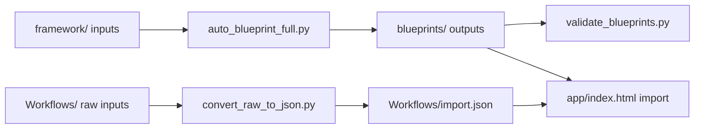

# Architecture

This document describes the end-to-end flow, core components, and IO contracts for the NamoFoundry repository.

## Overview
The system converts source files into structured blueprint JSON files, validates them, and visualizes them in a local web app. The primary flow is:
1) Ingest files under `framework/`.
2) Convert to blueprint JSON via `tools/auto_blueprint_full.py`.
3) Validate outputs via `tools/validate_blueprints.py`.
4) Import JSON into `app/index.html` for visualization.

## Component map
- `tools/auto_blueprint_full.py`: full pipeline ingestion and blueprint generation.
- `tools/schema_blueprint.json`: blueprint schema contract.
- `tools/validate_blueprints.py`: validation and reporting.
- `scripts/convert_raw_to_json.py`: manual conversion for simple `.txt`/`.md`.
- `scripts/transform_framework_docs.py`: document-to-markdown transform.
- `app/`: static app that visualizes imported JSON.
- `tests/`: unit tests for tools.

## Data flow

## IO contracts

### Blueprint schema
The blueprint JSON format is defined in `tools/schema_blueprint.json`. Outputs should include:
- `schema_version`
- `id`, `brand`, `title`, `meta_definition`, `sections`, `status`, `version`
- `metadata` with source, pipeline, and hash information

### Manifest summary
The full pipeline can emit a manifest with:
- run metadata (start/end, counts)
- per-file status and hash
- warnings and errors

### App import/export format
The app import/export format is a JSON array of items with:
- `id`, `title`, `author`, `nature`, `domain`, `status`, `tags`
- `content`, `completeness`, `createdAt`
Exported JSON preserves the same shape for re-import.

## Entry points
- Manual conversion: `python scripts/convert_raw_to_json.py`
- Full pipeline: `python tools/auto_blueprint_full.py`
- Validation: `python tools/validate_blueprints.py`
- Migration: `python tools/migrate_blueprints.py --apply`
- App: open `app/index.html`

## Dependencies
- Python libraries: `google-genai`, `jsonschema`, `PyPDF2`, `python-docx`, `requests`
- Node.js: required for `tests/test_normalize.js`

## Scalability safeguards
- Limit intake with `--max-files` and `--max-bytes`.
- Skip unchanged inputs with `--skip-unchanged` to reduce rework.
- Scale CPU-bound steps with `--workers`.

## Error handling
- Unsupported formats are skipped with a warning.
- Empty or unreadable content is logged and recorded in the manifest.
- Validation failures return a non-zero exit code in strict mode.
